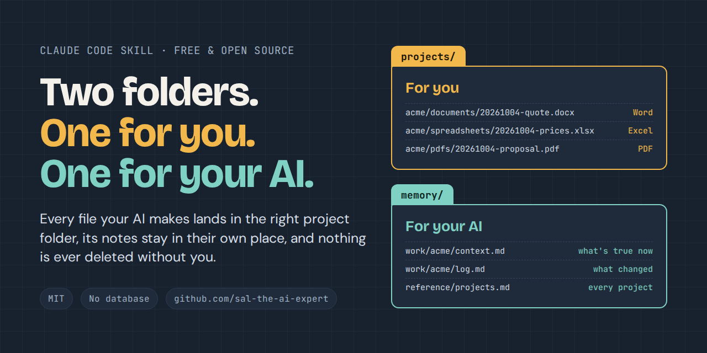

<p align="center">
  
</p>

<h1 align="center">AI Filing Cabinet</h1>

<p align="center"><em>The two-folder workspace for you and your AI.</em></p>

<p align="center">
  <a href="LICENSE"></a>
  
  
  
  
</p>

**A filing system your AI follows.** You pick one folder. Every Word doc, spreadsheet and PDF your AI makes is saved there straight away, in the right project, with a date on the front. The AI keeps its own short notes in a separate folder so it remembers each project next time. And it never deletes anything: if something looks like junk, it goes on a list for you to decide.

Built for business owners who use AI every day and are tired of hunting through chat downloads, sandbox folders and files called `final-v3-FINAL.docx`.

| | |
|---|---|
| **Asks first** | Before anything else, it asks which folder to use, and remembers your answer. |
| **Saves everything, straight away** | Every file goes into `projects/<project>/<type>/` the moment it's made, and you're told the exact path. A download link in chat is not a save. |
| **Remembers your projects** | Short plain-text notes per project (`context.md` for what's true now, `log.md` for what changed), so a new chat picks up where the last one stopped. |
| **Never deletes** | Junk and duplicates are moved to `_review/quarantine/` and listed in `_review/DELETE-QUEUE.md`. You decide. |
| **Tidies on your say-so** | Point it at an existing mess: it shows a plan first, moves only what you approve, and logs every move so it can be undone. |
| **Checks itself** | A read-only audit finds loose files, missing dates and files in the wrong place, with the fix for each. |
| **Plain files, no lock-in** | Ordinary folders and markdown. No database, no account, nothing leaves your computer. |

## How it is laid out

```
workspace/
├── CLAUDE.md        the rules your AI reads first
├── memory/          FOR THE AI: short markdown notes
│   ├── _index.md
│   ├── reference/projects.md      list of every project (the registry)
│   └── work/<project>/context.md + log.md
├── projects/        FOR YOU: finished .docx .xlsx .pptx .pdf images
│   └── <project>/<type>/20260930-name.ext
├── general/         one-off work with no project
└── _review/         waiting for YOUR decision: cleanup plans, the delete queue
```

## What you get

| Piece | What it does |
|---|---|
| `scaffold.py` | Builds the workspace and registers projects. Never overwrites anything. |
| `cleanup.py` | Tidies a messy folder in two steps: `plan` writes a list of proposed moves and changes nothing; `apply` moves only what you approved. Never deletes: junk goes to `_review/quarantine/` and onto a delete queue for you. Every move is logged so it can be undone. |
| `audit.py` | Read-only check. Finds loose files, unregistered folders, missing dates, files in the wrong half, duplicate spellings. Tells you the fix for each. |
| `guard_workspace.py` | Optional hook. Stops Claude saving a file in the wrong place and tells it where to go instead. Blocks the common shell delete commands (`rm`, `find -delete`, `git clean`, `truncate`, Windows `del`...) aimed at the workspace and tells Claude to queue the file for you. A seatbelt, not a sandbox. Ignores dotfiles like `.git` and `.claude`. |
| `SKILL.md` | Teaches Claude the rules: ask which folder first, save every file there as it's made, never delete. |
| `examples/sample-workspace/` | A small fictional workspace so you can see it working. |

No dependencies beyond Python 3.9+. No network access. No data leaves your machine.

## Install

**As a Claude Code plugin**

```
/plugin marketplace add sal-the-ai-expert/ai-filing-cabinet
/plugin install ai-filing-cabinet@ai-filing-cabinet
```

**Just the skill** (works anywhere skills work): copy `plugins/two-folder-workspace/skills/two-folder-workspace/` into your skills folder.

**Just the scripts:** they run on their own.

```
python3 plugins/two-folder-workspace/skills/two-folder-workspace/scripts/scaffold.py init ~/my-workspace --demo
python3 plugins/two-folder-workspace/skills/two-folder-workspace/scripts/audit.py ~/my-workspace
```

## Try it in five minutes

1. Install the plugin and start a session. Claude asks: *"Which folder should I keep everything in?"* Point it at a folder (new or existing).
2. Tell it your main projects or clients. It registers each one.
3. Ask for something real: "Write a quote for Acme as a Word file." It saves to `projects/acme-plumbing/documents/YYYYMMDD-quote.docx` and tells you the path.
4. Got an existing mess? Ask it to tidy up. It shows you a plan first, moves only what you approve, and puts anything deletable on a list for you.

Or by hand:

```
scaffold.py init ~/my-workspace
scaffold.py add-project ~/my-workspace acme-plumbing --name "Acme Plumbing"
audit.py ~/my-workspace
cleanup.py plan ~/my-workspace      # read _review/CLEANUP-PLAN.md
cleanup.py apply ~/my-workspace     # only after you're happy with the plan
```

## The rules (and why)

1. **One folder, your choice.** The AI asks where before it saves anything, and saves every file there as soon as it's made.
2. **Nothing gets deleted by the AI.** Junk and duplicates go to `_review/quarantine/` and onto `_review/DELETE-QUEUE.md`. You decide.
3. **The root is locked.** Five items only (plus a small `.two-folder.json` settings file, and dotfiles such as `.git` are ignored). A crowded top level is where drift starts.
4. **A project gets a registry row before it gets a folder.** This stops "Acme", "acme-plumbing" and "AcmeInc" appearing as three projects.
5. **Date-prefix every finished file** (`YYYYMMDD-`). You can sort by name and see the newest.
6. **Type folders, never loose files.** documents, spreadsheets, presentations, pdfs, designs, code, exports.
7. **`context.md` is what's true now** (overwrite it). **`log.md` is history** (append only).
8. **If unsure where something goes, the AI asks.** It does not guess.

## What this does not do

- The guard checks new files Claude creates and the common shell delete commands. It can't see a delete hidden inside a script, a path in a variable it can't resolve, or what other apps do. It also treats deleting anything in the workspace as off-limits, including build folders in a repo you keep there: do those yourself, or turn off `no-delete`. That is why the rules come first and `audit.py` exists.
- It is a folder discipline, not a search engine. It suits a few dozen projects. If you need semantic search over thousands of notes, pair it with a tool like [claude-mem](https://github.com/thedotmack/claude-mem) or [basic-memory](https://github.com/basicmachines-co/basic-memory).
- The guard is Python-based: on Windows, `python3` may not exist; use WSL or edit `hooks.json` to call `python` (or `py -3`). Where the hook fails to start, it fails open and the audit is your safety net.
- The rule "register a project before creating its folder" is checked by the audit, not blocked by the guard.
- It won't reorganise your files on its own. `cleanup.py` proposes; you approve. Files it can't place with confidence are left for you to decide.

## Configuration

`.two-folder.json` at the workspace root:

```json
{
  "root_allow": ["CLAUDE.md", "memory", "projects", "general", "_review", ".two-folder.json"],
  "enforce": ["root", "loose", "dateprefix", "memory-split", "no-delete"],
  "undated_ok": ["projects/acme/documents/template.docx"],
  "extra_type_folders": ["contracts", "proposals"],
  "stale_days": 60
}
```

Remove an item from `enforce` to turn that rule off. List living templates under `undated_ok`. Add your own type folders (such as `contracts`) under `extra_type_folders`. Repos kept under a `code/` folder keep their own file names.

## Tests

```
python3 -m unittest discover -s tests -v
```

## Licence

MIT. See LICENSE.
